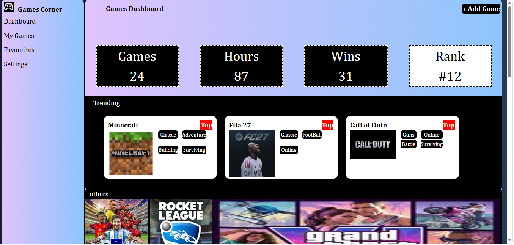
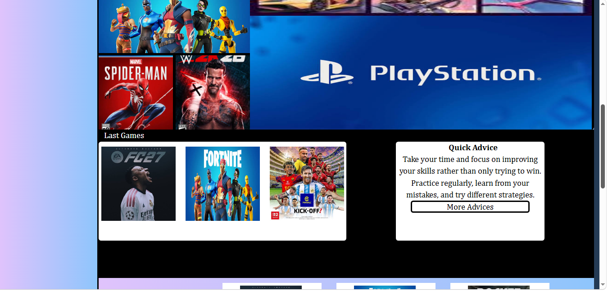
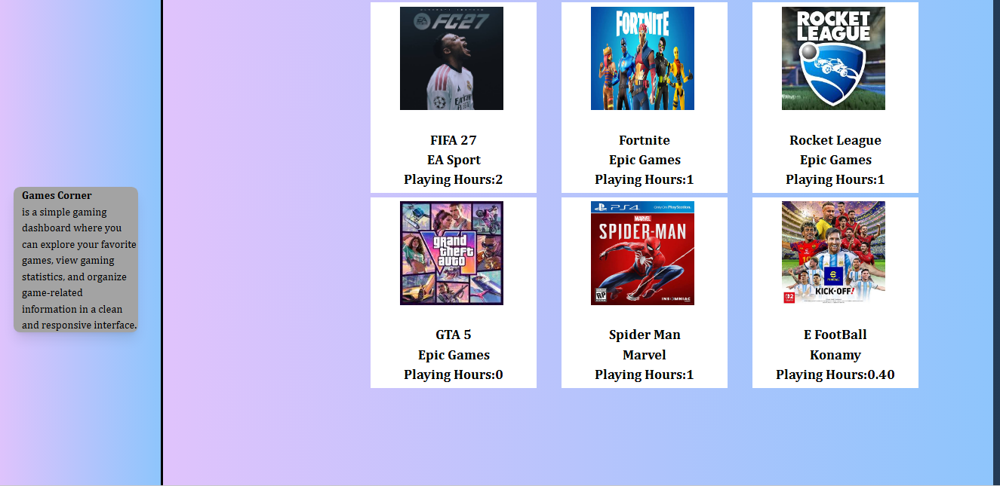

# Games Corner — Gaming Dashboard

A modern gaming dashboard built to organize and display gaming-related information in a clean and responsive interface.

## Features

- Gaming dashboard with statistics
- Display of trending games
- Organized game sections
- Navigation sidebar
- Game cards with images and badges
- Responsive layout
- Hover effects and interactive UI elements

## Technologies & Tools

- HTML
- CSS
- Tailwind CSS

## Project Description

Games Corner is a gaming dashboard designed to showcase favorite games, gaming statistics, trending games, and other game-related information.

The project focuses on creating a clean, organized, and responsive user interface using HTML, CSS, and Tailwind CSS.

## Screenshots

## Project Structure

- `index.html` — Main dashboard page
- `index.css` — Custom CSS styles
- `images/` — Game images and project assets
